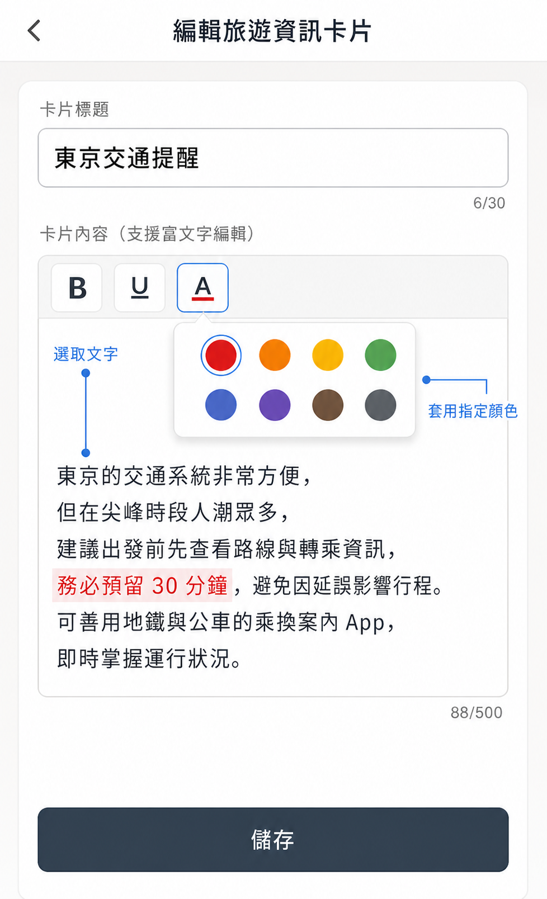
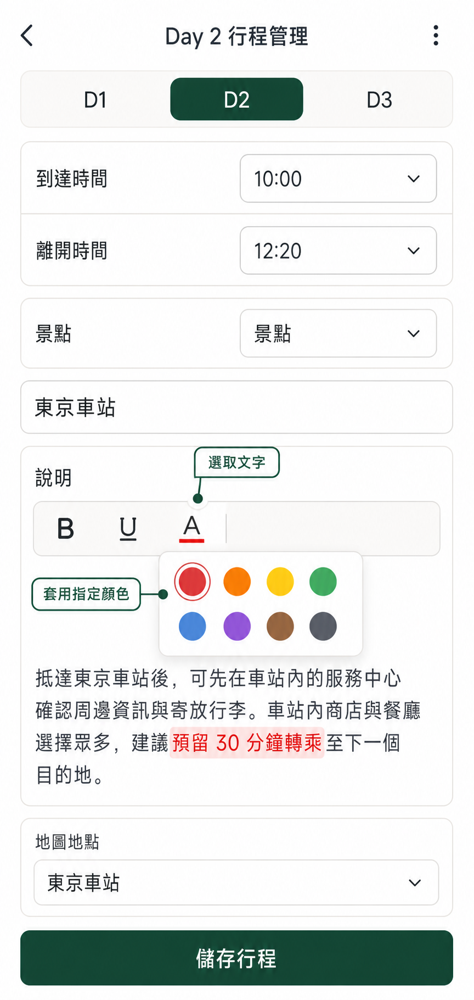

# V3.5.5 行程返回、外部連結與資訊文字醒目規格

> 狀態：已於 2026-08-27 由 Product Owner 完成合併與部署；電腦版驗證通過，iOS／手機實機驗證延後
>
> 版本：V3.5.5（Patch）；建立日期：2026-08-27

## 範圍與修改邊界

- 本版修正既有行程返回行為、資訊卡片的連結／文字呈現，以及每日詳細行程「說明」欄的文字呈現，不新增資料表、Supabase migration、RLS 規則、角色或離線同步流程。
- 保留既有卡片標題、純文字、換行、網址辨識、排序、敏感資料可見性與雲端同步行為。
- 所有外部網址仍只接受通過 HTTP／HTTPS 驗證的安全 URL，並保留 `noopener`、`noreferrer` 隔離。
- UI 修改只允許發生在兩個文字編輯欄位：資訊卡片的「卡片內容」與每日詳細行程活動的「說明」。新增的格式工具列與文字呈現所需變更，僅限這兩個欄位。
- 除上述兩個文字編輯欄位外，其他 App 欄位、既有圖示、按鈕位置、文案、版面、功能與互動行為均不得變動、替換或重新設計。

## 修正項目

### 1. 刪除行程後的首頁選取

刪除目前選取的行程並返回 App 主頁時，系統必須在所有未刪除行程中，套用與「進入 App 時」完全相同的既有預設選取規則。不得繼續指向已刪除 ID、停留空白狀態，或繞過既有預設規則而任意選取行程。

### 2. 資訊卡片的外部瀏覽器連結

- 資訊卡片中的一般 HTTP／HTTPS 超連結，點擊後應交由裝置的系統預設外部瀏覽器開啟，而不是 App 內嵌網頁。
- 不變更既有網址文字顯示、可點擊範圍或安全驗證規則。
- Android、iOS 與桌面 PWA 都須實機確認實際開啟目的地；若平台不允許 PWA 強制指定瀏覽器，採該平台能交由系統處理的最接近方式，且不得改回 App 內嵌網頁。

### 3. Google Maps 深度連結

- 當資訊卡片連結辨識為 Google Maps 網址時，優先以平台對應的 Google Maps deep link／intent 開啟已安裝的 Google Maps App。
- Google Maps App 未安裝、deep link 失敗或平台不支援時，必須安全回退至系統外部瀏覽器的 Google Maps 網頁。
- 一般非 Google Maps 網址不得套用地圖 deep link。

### 4. 資訊卡片局部文字顏色

- 在管理模式的資訊卡片內容編輯器，以及每日詳細行程活動的「說明」欄中，使用者可選取單行或任意局部文字，從文字顏色工具選擇指定顏色。
- 手機／平板以長按文字後出現系統選取控制點，再拖曳控制點選取範圍；電腦以滑鼠左鍵按住拖曳選取範圍。兩種操作都沿用瀏覽器原生文字選取行為。
- 儲存後只有被選取的文字套用所選顏色；其餘文字保留原本預設色，且不提供「整欄套同色」功能。
- 不提供卡片即時預覽功能；重新開啟卡片、離線儲存、同步後重載及不同角色可讀取的卡片，都必須正確保留文字顏色與純文字內容。
- 預設顏色與色票須符合可讀性；使用者未套色的文字一律使用現有深灰文字色。

## 操作示意預覽

操作流程：選取文字 → 點選「A」文字顏色 → 選擇色票 → 儲存。

> 此圖是已確認通過的操作方向，不是最終程式畫面；已符合「局部文字套色、不可整欄同色、無即時預覽」的需求。

### 每日詳細行程「說明」欄示意

色彩工具只加在每日詳細行程活動的「說明」欄；到達時間、離開時間、類型、活動標題與地圖地點維持既有單一欄位輸入，不加入文字顏色工具。

> 此每日詳細行程示意沿用已確認的工具操作方向；Product Owner 已確認畫面位置。實作時僅可修改「說明」欄，其他欄位、圖示與功能維持不變。

## UI 出現位置與權限

局部文字顏色工具適用於共用的「資訊卡片」模組及每日詳細行程活動的「說明」欄；本版外部連結行為適用於資訊卡片，且每日詳細行程既有「地圖導航」按鈕會一併套用 Google Maps App 優先／外部瀏覽器回退規則。功能不會出現在清單、旅費帳本、外幣換算、旅程設定或自訂文字頁。

| 入口功能 | 適用行程 | 本版 UI／行為 | 可操作角色 |
|---|---|---|---|
| 側邊欄「其他資訊」 | 跟團、自由行的所有 Trip | 進入「管理」後，新增或編輯任一資訊卡片時，在「卡片內容」欄位上方顯示文字顏色工具；已儲存卡片中的一般連結與 Google Maps 連結亦套用本版外部開啟規則。 | 目前 Trip 的 `trip_editor`、`super_admin` 可新增／編輯；Guest、User 僅依權限閱讀卡片及開啟可見連結。 |
| 「其他資訊」內各分類 | 現有分類，例如航班、交通、住宿、景點、餐飲、購物、保險與其他 | 同上。色彩格式屬於每張資訊卡片的內容，不影響卡片標題、分類、排序或敏感可見性。 | 同上。 |
| 側邊欄「領隊導遊聯絡資訊」 | 跟團 Trip | 使用同一資訊卡片編輯器；文字顏色工具與外部連結規則均適用。 | 目前 Trip 的 `trip_editor`、`super_admin` 可新增／編輯；Guest、User 只可讀取被授權的卡片。 |
| 側邊欄「自駕租車須知」 | 自由行 Trip | 使用同一資訊卡片編輯器；文字顏色工具與外部連結規則均適用。 | 目前 Trip 的 `trip_editor`、`super_admin` 可新增／編輯；Guest、User 只可讀取被授權的卡片。 |
| 側邊欄「每日詳細行程」 | 跟團、自由行的所有 Trip | 選擇日期 → 點「管理」→「新增活動」或活動「編輯」後，在「說明」欄位上方顯示文字顏色工具；地圖地點的「地圖導航」按鈕套用 Google Maps App 優先開啟規則。活動標題、時間、類型與地圖地點欄位不提供文字顏色工具。 | 目前 Trip 的 `trip_editor`、`super_admin`，且裝置在線時可新增／編輯；Guest、User 只閱讀行程。 |

資訊卡片與每日詳細行程的閱讀模式都不顯示編輯工具列；只有具編輯權限者點選「管理」後，再點選「新增」或既有項目的「編輯」，才會看到文字選取與色彩工具。敏感卡片仍沿用既有「僅行程管理者可查看」規則，不因文字顏色功能改變可見範圍。

## 驗收條件

1. 刪除目前行程後回首頁，套用結果與重新進入 App 時的既有預設選取規則完全一致。
2. 一般資訊連結不在 App 內嵌頁面載入，且所有支援平台均以系統外部瀏覽器或其系統等效流程開啟。
3. 已安裝 Google Maps App 的測試裝置，Google Maps 連結直接進入該 App；未安裝時能回退至外部瀏覽器網頁。
4. 資訊卡片內容與每日詳細行程「說明」欄都能以手機長按後的控制點拖曳或電腦滑鼠左鍵按住拖曳，選取同一段落的局部文字並套色；只有該片段顯示指定色，且介面不顯示即時預覽。儲存、重新載入、離線後恢復連線同步，以及不同可見角色讀取時均保持一致。
5. `npm run lint`、`npx tsc --noEmit`、`npm run build`、`git diff --check` 與既有其他資訊／離線同步回歸均通過。

## 發布前實作與驗證紀錄

- 已完成刪除行程後共用 `findDefaultTrip` 規則、外部 HTTP／HTTPS 連結、Google Maps universal URL，以及兩個指定文字欄位的安全局部套色儲存與顯示。
- 本機瀏覽器已確認資訊卡片「內容」及每日詳細行程「說明」只新增文字顏色工具，並能只對反白片段套色；測試期間未儲存或刪除任何既有資料。
- `npm run lint`、`npx tsc --noEmit`、`npm run build`、版本歷史與瀏覽器安全驗證均已於 2026-08-27 通過。
- ✅ 已通過（2026-08-27，電腦版）：刪除目前行程後，首頁選取結果與進入 App 時的 `findDefaultTrip` 規則一致。
- ✅ 已通過（2026-08-27，電腦版）：資訊卡片的一般 HTTP／HTTPS 超連結在外部瀏覽器分頁開啟，App 原頁面維持不變。
- ✅ 已通過（2026-08-27，電腦版）：資訊卡片 Google Maps universal URL 在外部瀏覽器分頁正確開啟 Google Maps 網頁。手機 Google Maps 專用 App 開啟及瀏覽器回退行為延後驗證。
- ✅ 已通過（2026-08-27，電腦版）：每日詳細行程活動的「地圖導航」在外部瀏覽器分頁開啟 Google Maps，並顯示設定的地圖地點。
- ✅ 已通過（2026-08-27，電腦版）：文字色盤位於 `A` 右側且左下角對齊按鈕底部；點擊 `A` 後反白選取仍可見，點擊色盤外空白處會收合。
- ✅ 已通過（2026-08-27，電腦版）：資訊卡片「內容」及每日詳細行程「說明」皆可只對局部文字套色，儲存與重新載入後仍保留指定顏色。
- ✅ 已通過（2026-08-27，電腦版）：離線修改、恢復連線同步後重載，以及 Guest、User、`trip_editor`、`super_admin` 四種角色的閱讀結果均正確。
- ⏭ Android／iOS 手機實機驗證延後：系統外部開啟、Google Maps App／瀏覽器回退、原生長按控制點拖曳，以及實際儲存、重載、離線同步與角色讀取，待具備測試設備後再進行。
