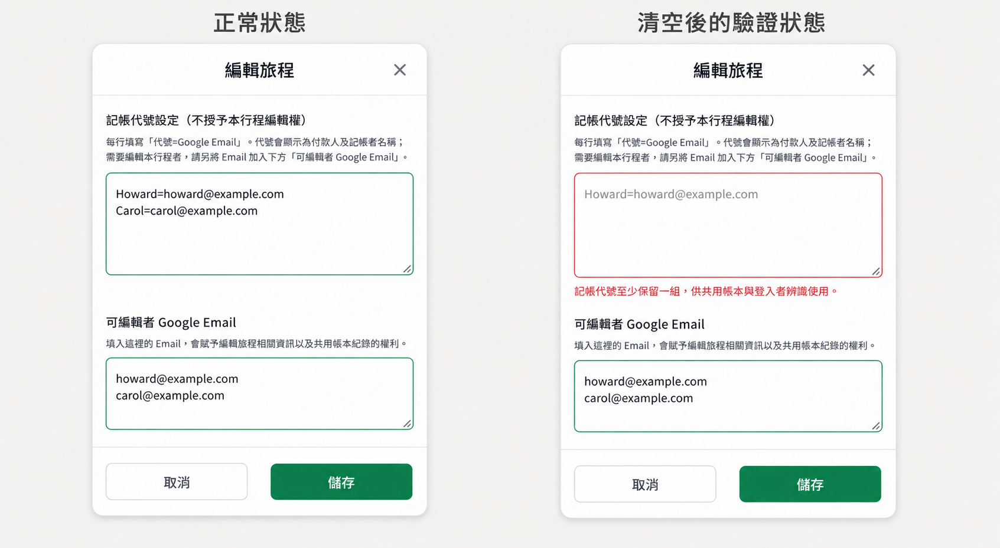
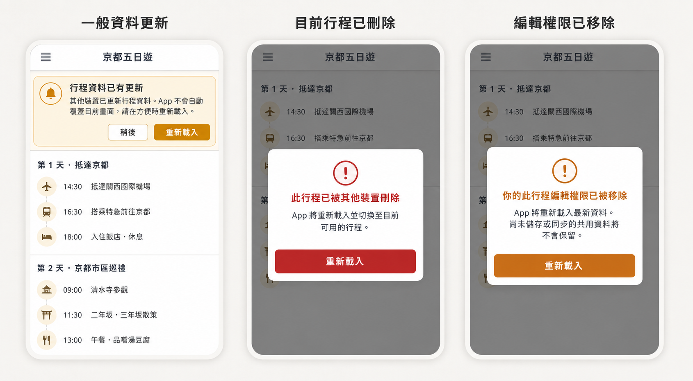
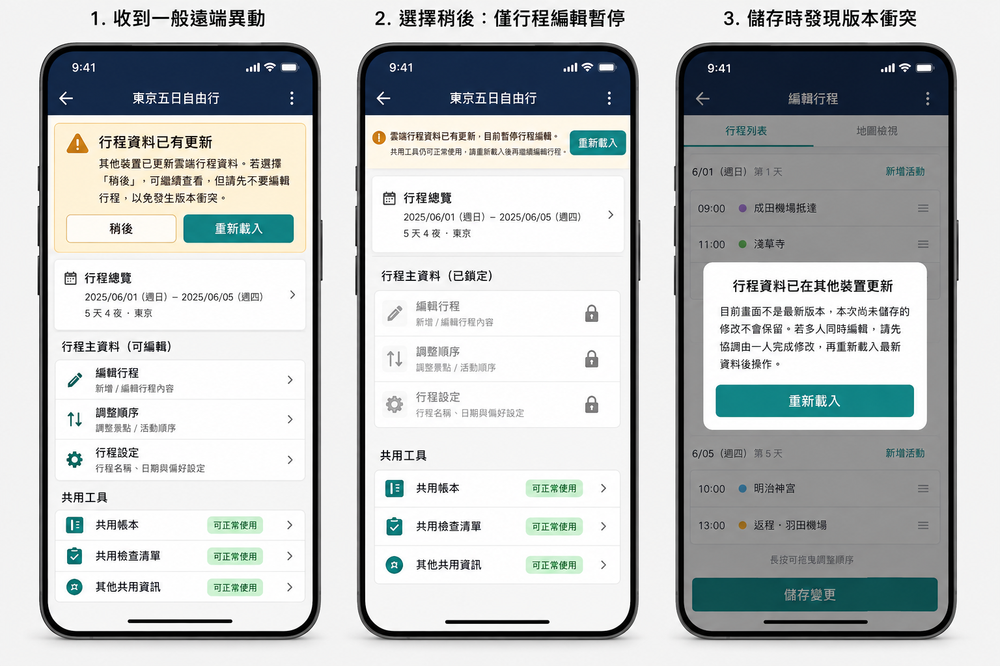
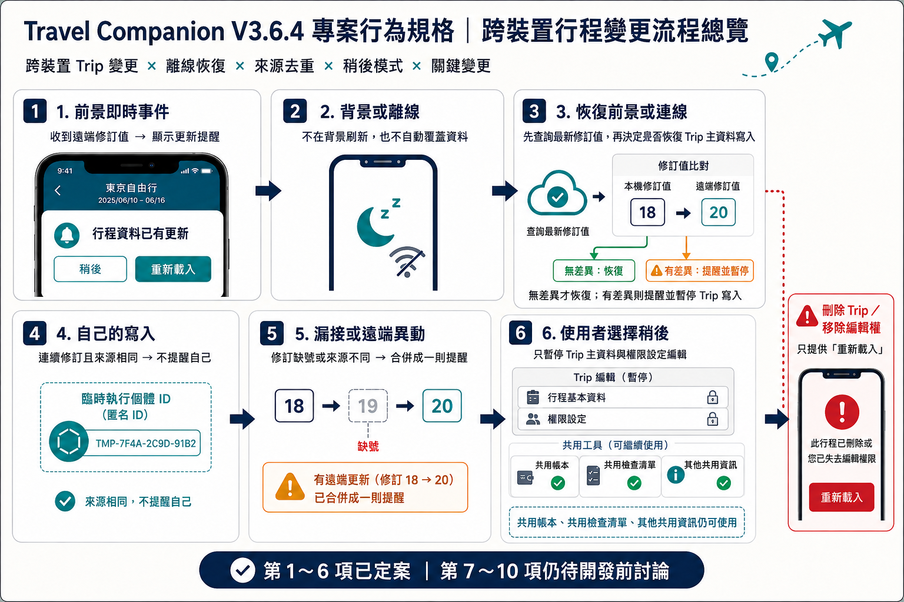

# V3.6.4 歷史唯讀參與者與跨裝置資料變動提醒規格

> 狀態：開發前十項議題已全部核准；待實作與驗證
>
> 建立日期：2026-09-03
>
> 最後整理：2026-09-04
>
> 版本類型：Patch
>
> 更新政策：必要更新；正式 metadata 預定為 `minimumSupportedVersion: 3.6.4`、`forceUpdate: true`

---

## 一、拆版原因與開發門檻

本版由原 V3.6.3 拆出，集中處理會跨越前端、權限、快取及 Supabase 同步邊界的兩項功能：

1. `trip_editor` 同時是歷史 Trip 參與者時，套用「歷史唯讀參與者」有效狀態。
2. 其他設備新增、修改或刪除 Trip，以及變更 `trip_editor` 指派時，顯示手動重新載入提醒。

需求、模擬圖與十項開發前議題均已由 Product Owner 核准，可進入 V3.6.4 實作與驗證。目前尚未修改程式、RLS 或 Realtime，也尚未建立或套用 production migration；後續仍須遵守本文件的測試、部署與回滾門檻。

---

## 二、歷史唯讀參與者

### 名稱與角色邊界

- 產品名稱定為「歷史唯讀參與者」。
- 這是依「登入帳號＋目前 Trip＋台灣歷史日期＋參與者 Email」計算的有效存取狀態，不是 User，也不直接新增或修改 `admin_users` 的全域角色值。
- 帳號仍保留原有 `trip_editor` 指派；切換到其他受指派且尚未結束的 Trip 時，仍依既有 `trip_editor` 權限操作。

### 成立條件

以下條件同時成立時進入「歷史唯讀參與者」狀態：

1. 使用者已登入。
2. 使用者是目前 Trip 被指派的 `trip_editor`。
3. 登入 Email 存在於目前 Trip 的參與者 Email 對應資料。
4. 目前 Trip 已依 `Asia/Taipei` 日期規則成為歷史行程。

### 可見與操作能力

- 保留 V3.6.2 歷史 `trip_editor` 原有的完整歷史共用資料讀取能力，包括共用帳本、雲端換匯歷史及依原權限可見的敏感其他資訊。
- 不得新增、修改、刪除、排序、勾選或同步任何歷史共用資料。
- 不顯示 `trip_editor` 專用的「歷史行程已鎖定」提醒。
- 私人資料仍依原本帳號擁有權處理，不因本狀態轉移、公開或交由管理者讀取。
- 非參與者的歷史 `trip_editor` 繼續沿用 V3.6.2 的完整唯讀能力與「歷史行程已鎖定」提醒。
- `super_admin` 的歷史管理權不變。

### 安全要求

- 前端隱藏編輯入口只是使用者介面行為；Supabase RLS（資料列權限）仍須拒絕所有歷史 `trip_editor` 共用資料寫入。
- 不得將此狀態誤映射成既有 User，避免共用帳本、雲端換匯歷史或敏感其他資訊被錯誤隱藏及本機快取被清除。
- 必須驗證跨午夜、離線啟動、重新登入、切換 Trip、參與者 Email 大小寫／空白正規化及舊快取情境。

### Trip 管理欄位與記帳代號

欄位文案定案為：

- `可編輯者 Google Email`
- `記帳代號設定（不授予本行程編輯權）`

相關規則：

- 記帳代號每行使用 `代號=Google Email`，只用於付款人、記帳者名稱與登入者辨識；不授予 Trip 編輯權。
- `可編輯者 Google Email` 只負責 Trip 編輯權指派。
- 建立新 Trip 時保留既有 `defaultParticipantProfiles`／`include_in_new_trip` 流程，自動帶入目前設定的兩組 Super Admin 帳號；不得把模擬圖中的示例帳號硬編碼進程式。
- 編輯既有 Trip 時保留原記帳代號資料。
- 記帳代號至少保留一組；錯誤文案為：`記帳代號至少保留一組，供共用帳本與登入者辨識使用。`
- 移除 `可編輯者 Google Email` 內的 Email，只取消 Trip 編輯權，不得連動刪除記帳代號。

> 模擬圖中的姓名與 Email 只示意欄位形式；正式畫面必須沿用既有 Super Admin 自動帶入資料。

### 已上傳共用帳目在撤權後的處理

- 被移除 `trip_editor` 指派後，既有帳目、付款人名稱、`recorded_by_email`、`owner_user_id` 與附件仍保留在原 Trip。
- 不自動刪除、不轉移擁有者，也不刪除記帳代號。
- 被撤權者失去該 Trip 共用帳本、附件與雲端換匯資料的雲端存取；即使是自己先前上傳的資料也相同。
- 仍具權限的編輯者及 `super_admin` 可繼續查看；必要時由 `super_admin` 修正。
- 歷史 Trip 的 `trip_editor` 仍遵守 V3.6.2 歷史唯讀限制。

---

## 三、跨裝置資料變動提醒：共同原則

- 遠端資料異動只產生提醒，不自動刷新 App，也不直接用 Realtime payload 覆蓋目前畫面。
- 使用者確認重新載入後，透過正常且受 RLS 保護的查詢重新取得資料。
- 不在使用者管理或編輯途中自動替換資料，也不無提示捨棄未儲存內容。
- 既有 Travel Tool（依附於 Trip 的共用帳本、共用檢查清單、其他共用資訊等）同步規則不得因本功能改寫。
- 十項開發前議題已全部確認；實作仍不得發布 `admin_users` 原始資料事件，且必須遵守第 7～10 項的安全與驗證門檻。

---

## 四、第 1 項已定案：事件範圍與撤權處理

### 會觸發全域失效訊號

- Trip 新增。
- Trip 主資料更新，包括名稱、日期／天數、參與者、行程內容及排序等實際儲存在 `trips` 的資料。
- Trip 刪除。
- `trip_editor` 指派新增或移除。

### 不納入本提醒的既有同步事件

- 共用帳本與附件。
- 共用檢查清單。
- 其他共用資訊。
- 匯率與換匯資料。
- 私人帳本及私人檢查清單。

上述功能維持各自既有同步與 Pending Queue（離線或同步失敗時暫存待上傳操作的佇列），不因 Trip 變動提醒重複發送通知。

### 目前 Trip 的編輯權被移除

此情況屬於安全事件：

1. Supabase RLS 立即拒絕後續共用資料寫入。
2. App 重新驗證目前 Trip 權限，停止該 Trip 的共用寫入與同步。
3. 清除過期的角色／授權快取、受限制的共用快取，以及該 Trip 尚未同步的共用待處理資料。
4. 私人帳本與私人檢查清單不得清除。
5. 顯示不可關閉的阻擋對話框，唯一操作為 `重新載入`。
6. 點擊後執行正常完整重新載入；若撤權後仍具一般 User 可見資格，依重新取得的權限顯示可用內容。

此設計依據使用情境為：撤權不頻繁、通常不在旅程進行中操作，且多發生於旅程結束或不再參加行程時，因此採簡單且安全的強制重新載入，不另做草稿匯出或複雜復原流程。

---

## 五、第 2 項已定案：提醒位置、文案與持續規則

### 一般遠端異動

- 在 App Header 下方、主要內容上方顯示全域持續橫幅，不使用短暫 Toast，也不自動消失。
- 標題：`行程資料已有更新`
- 內文：`其他裝置已更新雲端行程資料。若選擇「稍後」，可繼續查看，但請先不要編輯行程，以免發生版本衝突。`
- 操作：`稍後`、`重新載入`。
- 離線時停用重新載入，文案改為：`目前沒有網路連線，無法取得最新資料。恢復連線並重新載入前，請先不要編輯行程。`

### 選擇稍後

- 不重新查詢、不清除資料，也不捨棄目前未送出的內容。
- 畫面改顯示精簡但持續存在的唯讀狀態列：
  - `雲端行程資料已有更新，目前暫停行程編輯。`
  - `共用工具仍可正常使用，請重新載入後再繼續編輯行程。`
- 後續新事件只更新內部最新修訂值，不重複堆疊提示。
- App 恢復前景、網路重連或出現新事件時，若仍未重新載入，維持鎖定。

### 特殊狀態

- 目前 Trip 已刪除：顯示不可關閉的阻擋對話框，唯一操作為 `重新載入`。
- 目前 Trip 的 `trip_editor` 指派已移除：顯示不可關閉的阻擋對話框，唯一操作為 `重新載入`。
- 一般提醒若在後續檢查中確認成為上述狀態，立即升級為阻擋對話框。

> 上圖的一般更新文字為早期版面示意；正式文案與「稍後」後的鎖定範圍，以上述定案文字及下圖為準。

---

## 六、第 3 項已定案：重新載入粒度

- 所有 `重新載入` 都執行正常的完整 App reload，不開發局部 Trip refetch。
- 重新載入涵蓋登入 Session、Trip 清單、目前可用 Trip、角色權限、Trip 主資料與各功能正常啟動流程。
- 不主動觸發 PWA 應用程式更新，也不把資料重新載入與 Service Worker 更新綁定。
- 不使用 `sessionStorage` 保存原 Trip、頁面或日期；重新載入後沿用既有預設 Trip 與預設頁面規則。
- 接受使用者重新載入後可能需要手動返回原位置，以換取較少狀態恢復分支及更可靠的權限重建。

### 全域修訂值方向

採單一、可持久查詢的 App 資料修訂列，不建立逐 Trip 事件歷史：

- `revision`：單調遞增修訂值。
- `updated_at`：最後異動時間。
- `source_client_id`：匿名且暫時的 App 執行個體代號；不得存放帳號或裝置資訊。

Trip 主資料及 `trip_editor` 指派變動使修訂值遞增。由於採全域修訂值，其他 Trip 的異動也可能讓目前裝置顯示一般提醒；此限制已接受，以換取簡單、無事件表成長且容易補查的設計。

---

## 七、第 4 項已定案：未儲存狀態、稍後鎖定與版本衝突

### 不建立逐表單 dirty-state 系統

- 不為每個編輯表單新增複雜的未儲存狀態追蹤。
- 一般重新載入前清楚說明未按下儲存的內容不會保留；已送出並進入既有 Pending Queue 的資料依原同步規則處理。
- 使用者選擇 `稍後` 時保留目前畫面及尚未送出的內容，但受影響畫面的儲存按鈕停用；仍允許返回或關閉。

### 稍後只鎖定 Trip 主資料

鎖定會直接修改 `trips` 主資料或權限設定的入口：

- 行程基本資料與日期。
- 每日行程內容及排序。
- Trip 管理設定。
- `可編輯者 Google Email`。
- `記帳代號設定（不授予本行程編輯權）`。
- 其他實際儲存在 `trips` 主資料內的編輯項目。

以下具備獨立同步規劃的功能不鎖定：

- 共用帳本與附件。
- 共用檢查清單。
- 其他共用資訊。
- 匯率資料。
- 私人帳本。
- 私人檢查清單。

若遠端變更了記帳代號，共用帳本在重新載入前可能短暫顯示舊代號，但帳目資料仍依既有同步機制保存。

### Trip 主資料採樂觀併發控制

- 儲存 Trip 時，以畫面載入時取得的 `trips.updated_at` 作為基準，執行原子條件式 UPDATE。
- 資料庫版本與基準相同才允許儲存。
- 版本不相同時拒絕此次 Trip 儲存，不自動合併，也不得繼續同步編輯者 Email 清單。
- 衝突對話框標題：`行程資料已在其他裝置更新`
- 衝突內文：`目前畫面不是最新版本，本次尚未儲存的修改不會保留。若多人同時編輯，請先協調由一人完成修改，再重新載入最新資料後操作。`
- 唯一操作為 `重新載入`；不提供取消、稍後或再次強制儲存。
- 「取得編輯優先權」僅代表使用者間先行協調，不開發線上狀態、鎖定租約或分散式編輯鎖。

### Trip 刪除與撤權時的未同步資料

- 不顯示第二次確認，不允許繼續停留編輯。
- 清除該 Trip 尚未同步的共用資料並完整重新載入。
- 私人資料不得清除。
- Trip 刪除文案：`此行程已被其他裝置刪除。App 將清除本行程尚未同步的共用資料，重新載入並切換至目前可用的行程。`

> 圖中小字僅供版面層級示意；正式實作必須使用本文件記錄的完整定案文案。

---

## 八、第 5 項已定案：離線、背景與漏接補償

### 前景即時事件

- Realtime 收到全域修訂值變動後進入既定提醒流程。
- 約 400ms 內連續事件合併後再做一次 Trip 存在性與權限檢查，正常情況約一秒內顯示提醒。

### 背景與離線

- App 位於背景或裝置離線時不執行背景刷新、不輪詢，也不自動覆蓋資料。
- 離線時無法得知遠端是否變更，因此不預先鎖定畫面，維持既有離線操作規則。

### 恢復前景或網路連線

1. 查詢一次目前全域修訂值。
2. 在修訂檢查完成前，不恢復 Trip 主資料送出或重試。
3. 修訂值未變才恢復 Trip 主資料寫入。
4. 修訂值已變則顯示提醒；選擇稍後後依第 4 項只鎖定 Trip 主資料編輯。
5. 既有 Travel Tool 的獨立同步佇列不受此 Trip 主資料閘門阻擋。

### Realtime 訂閱失敗

- 訂閱重新建立成功時立即補查一次修訂值。
- Realtime 錯誤但一般資料 API 可用時也補查一次。
- 不新增固定輪詢計時器，也不持續顯示連線錯誤通知。

### 冷啟動與 PWA 重開

- 依正常啟動流程取得最新 Trip、權限與修訂值。
- 將查得修訂值設為新基準，不顯示更新提醒，因為此次啟動載入的就是最新資料。

---

## 九、第 6 項已定案：來源辨識與重複合併

### 匿名執行個體代號

- 每次 App 啟動使用 `crypto.randomUUID()` 產生暫時執行個體代號。
- 只保留於目前執行期間的記憶體，不寫入 `localStorage`。
- 不包含 Email、使用者 ID、裝置型號或可識別個人的資訊。
- 同一裝置的不同分頁視為不同編輯畫面，彼此仍會收到提醒，避免多分頁競態。
- Supabase 請求以自訂 request header 附上代號；資料庫修訂觸發器只接收通過格式檢查的值。Dashboard、SQL 或舊版 App 沒有合法代號時，來源保存為空值並一律視為遠端異動。

### 修訂判斷

- `revision <= 已知 revision`：重複或延遲事件，忽略。
- `revision = 已知 revision + 1` 且來源為目前執行個體：只更新基準，不提醒自己。
- 來源不同：顯示遠端異動提醒。
- 修訂值有缺號：即使最新來源是自己，也視為可能漏接其他裝置異動並顯示提醒。
- 冷啟動直接建立最新基準，不回放舊提醒。

### 多筆事件

- 約 400ms 內連續事件合併成一次狀態檢查與一則提醒。
- 不顯示事件數量，也不建立事件歷史清單。
- 提醒已存在時只更新內部最新修訂值。
- 刪除目前 Trip 或移除目前編輯權時，從一般提醒升級成強制重新載入。
- 已選擇稍後時，新事件不解除鎖定。

---

## 十、第 7 項已定案：權限與隱私

### 修訂訊號讀取資格

- 僅已登入且目前仍具有至少一筆 `trip_editor` 指派，或為 `super_admin` 的帳號，可讀取及訂閱修訂訊號。
- 未登入者與沒有任何有效 `trip_editor` 指派的一般 User 不訂閱，也不得透過 Data API、RPC 或 Realtime 讀取修訂訊號。
- 「歷史唯讀參與者」仍保有原本的 `trip_editor` 指派，因此可讀取修訂訊號；此資格不擴張其 Trip、共用資料或敏感資料存取權。
- 權限判斷必須由 Supabase RLS 或等效的伺服器端授權完成，不得只依前端是否建立訂閱判斷。

### 最小化 payload

- 前端可取得的修訂資料僅限 `revision`、`updated_at` 與 `source_client_id`。
- 訊號不得包含 Trip ID、Trip 名稱或內容、Email、角色、參與者、異動欄位、操作人員或任何 `admin_users` 原始資料。
- `source_client_id` 只接受符合格式的匿名暫時執行個體代號；不得保存帳號、裝置型號或其他可識別資訊。
- 修訂訊號只表示「可能有資料失效」，不得作為存在性、角色或寫入授權依據。

### 收到訊號後的安全處理

- 前端收到訊號後，仍以正常且受 RLS 保護的查詢重新確認目前 Trip 是否存在及目前帳號權限。
- 不得直接使用 Realtime payload 更新 Trip、角色、參與者或畫面資料。
- 即使修訂訊號被重放、延遲或偽造，後續查詢與寫入仍須由既有 RLS、歷史寫入鎖及樂觀併發條件拒絕未授權操作。

---

## 十一、第 8 項已定案：持久修訂列與帳號專屬私有 Broadcast

### 替代方案評估

- 不採修訂表的 Postgres Changes：雖然設定較少，但移除帳號最後一筆 `trip_editor` 指派後，新的 RLS 結果可能使被撤權裝置收不到該次事件；此方案也不是 Supabase 對新 Realtime 用途的優先建議。
- 不採單一全域私有 Broadcast 頻道：Realtime 頻道授權會在連線期間快取，已撤權但刻意維持舊連線的客戶端可能在權限重新檢查前繼續收到後續的全域最小訊號。
- 不採固定輪詢或純 RPC：會增加持續查詢量，且無法符合前景即時提醒目標。
- 不引入 Edge Function、Webhook 或外部訊息服務：本需求可由資料庫交易與 Supabase Realtime 完成，額外服務只會增加密鑰、部署及失敗復原邊界。

### 最終資料與通知架構

- 建立單一持久全域修訂資料列，僅保存 `revision`、`updated_at` 與 `source_client_id`；固定主鍵或等效 constraint 必須保證只能存在一列。
- `trips` 新增、修改、刪除，以及 `trip_editor` 指派新增、修改或移除時，由資料庫 trigger 在同一交易內原子遞增修訂值。
- 即時通知使用資料庫端 `realtime.send()` 發送自訂最小 payload，不使用會帶出 `NEW`／`OLD` 原始資料的 `realtime.broadcast_changes()`。
- 每位接收者使用帳號專屬私有 topic，例如 `travel-companion:data-revision:<auth.uid>`；前端以 `private: true` 訂閱自己的 topic。
- 每次異動只向異動完成後仍具至少一筆 `trip_editor` 指派的帳號及 `super_admin` 發送；移除指派時，另向該次被移除的帳號發送一次撤權失效訊號。被撤權帳號不會收到之後其他異動的訊號。
- topic 不包含 Email；資料庫內部以正規化 Email 對應 Auth user ID。無 Auth 帳號的預先指派不建立即時接收者，其日後首次登入或冷啟動直接取得最新資料與權限。
- 不把 `trips`、`admin_users` 或修訂表新增至 `supabase_realtime` Postgres Changes publication。

### RLS、GRANT 與函式邊界

- 修訂表啟用 RLS；`anon` 無任何權限，`authenticated` 只有符合第 7 項資格時可 `SELECT`，前端沒有 `INSERT`、`UPDATE` 或 `DELETE` 權限。
- `realtime.messages` 只建立接收 Broadcast 所需的 `SELECT` policy，限制 `extension = 'broadcast'`、topic 的 user ID 必須等於目前 `auth.uid()`，且連線授權當下仍具有至少一筆 `trip_editor` 指派或 `super_admin` 身分；不建立供前端發送的 `INSERT` policy。
- 前端必須先設定 Realtime Auth，再以私有頻道訂閱；一般 User 的正式 App 不建立修訂訂閱。
- trigger function 與內部 Auth ID 對應函式放在非公開 schema、固定空 `search_path`，並撤銷 `PUBLIC`、`anon`、`authenticated` 的直接執行權；不得建立可由前端呼叫的 privileged RPC。
- 2026 年 Supabase Realtime schema 鎖定後，只建立官方仍允許的 `realtime.messages` RLS policy，不建立、修改或刪除 `realtime` schema 內的其他物件。

### 送達與安全保證

- Broadcast 是快速失效提示，不是授權依據，也不保證離線期間逐則送達；漏接由持久修訂值、前景恢復、網路重連及正常冷啟動流程補償。
- 撤權的安全性不依賴 Broadcast：資料庫 RLS 立即拒絕後續寫入；前端收到撤權訊號後立即停止相關同步、解除訂閱並重新驗證權限。
- Broadcast 與修訂列更新必須屬於同一資料庫交易；交易失敗時不得只送出通知或只遞增修訂值。
- migration 須包含資料表、初始列、constraint、必要索引、函式、trigger、RLS、GRANT 與 Realtime policy，並先在本機或隔離環境完成角色測試、資料庫 advisor 與回滾驗證；production 套用仍須依第 9～10 項的放行門檻執行。

---

## 十二、第 9 項已定案：相容、部署與回滾

### 更新政策

- V3.6.4 採必要更新；正式 metadata 使用 `minimumSupportedVersion: 3.6.4`、`forceUpdate: true`。
- V3.6.3 不理解修訂訊號、稍後鎖定及 Trip 樂觀併發控制；若允許繼續操作，可能以舊畫面覆蓋其他裝置的新 Trip 主資料，因此不列為 V3.6.4 資料庫規則下的支援版本。
- 必要更新檢查維持既有啟動、恢復前景及網路重連時機；離線中的舊版不得因無法取得 metadata 而繞過既有必要更新狀態。

### 正式部署順序

1. 完成第 10 項驗證、migration review、資料庫 advisor、回滾演練及發布前備份／結構快照。
2. 先以單一交易套用向下相容的資料庫 migration；若任一步失敗，整筆交易回滾，不留下半套 schema。
3. 使用仍在執行的 V3.6.3 完成登入、讀取、Trip 儲存及既有 Travel Tool 冒煙測試；V3.6.3 不訂閱新頻道，但 migration 在必要更新 metadata 公開前不得破壞其既有操作。
4. 部署 V3.6.4 App、Service Worker 與靜態資產，確認正式資產可下載、登入及讀取新版資料庫。
5. 最後公開 V3.6.4 `app-version.json`，才對 V3.6.3 與更早版本啟用必要更新；不得在資料庫或新版資產就緒前先發布必要更新 metadata。
6. 完成正式環境雙裝置、撤權、版本衝突、更新流程與前景／重連冒煙測試後，才視為發布完成。

### 舊版相容邊界

- migration 以新增修訂列、函式、trigger、RLS 與 Broadcast policy 為主，不變更 V3.6.3 既有 API 回傳格式，也不將原始資料加入新的 publication。
- 資料庫 migration 至必要更新 metadata 公開之間只允許短暫部署驗證窗口，不作為長期混用期。
- 已開啟的 V3.6.3 會在啟動、回到前景或恢復網路時重新檢查 metadata；取得必要更新政策後不得略過並繼續操作。
- V3.6.4 不依賴只有新版前端才會執行的檢查保護資料；RLS、歷史寫入鎖及其他資料庫限制仍是最終安全邊界。

### 回滾方式

- 發布前須準備並演練獨立的修正／回滾 SQL；production 發生問題時，不臨時手寫或直接反向執行未驗證 SQL。
- 若新 trigger 造成寫入錯誤或鎖定，先以已驗證的修正 migration 停用新 trigger 與 Broadcast，再處理前端回滾，優先恢復資料操作。
- 前端回滾至 V3.6.3 時，同步將公開 metadata 回復為 `version: 3.6.3`、`minimumSupportedVersion: 3.6.2`、`forceUpdate: false`，並驗證 Service Worker 確實接管舊版資產。
- 回滾 App 後，新修訂表可暫時保留；不在緊急處理期間刪除資料表或修訂資料。確認無新版 App 使用後，再以另一筆 reviewed migration 清理不用的 policy、函式與資料表。
- 若 migration 在交易提交前失敗，直接由資料庫交易回滾；若已成功提交，所有修正都以新的 migration 前進處理，不改寫或刪除已套用的 migration history。

---

## 十三、第 10 項已定案：驗證責任、矩陣與紀錄

### 完整紀錄要求

- 可由開發與自動化環境完成的項目全部由 Codex 執行，不要求 Product Owner 重複手動操作。
- 每項驗證都必須留下可追溯紀錄，至少包含：測試 ID、日期、環境、App 版本／commit、帳號角色、前置條件、操作、預期、實際結果、通過／失敗、證據位置、資料清理及已知限制。
- 自動測試須保留指令與完整結果摘要；瀏覽器測試須記錄瀏覽器、viewport、console error、必要畫面或狀態證據；資料庫測試須記錄 migration 狀態、角色、SQL 結果及 advisor 結果。
- 失敗案例不得只在對話中說明，必須列入規格或獨立驗證報告並連回本文件；修正後要保留原失敗原因及重測結果。
- Product Owner 的實機結果由 Codex 依回報整理進驗證報告，避免只留下口頭結論。

### Codex 負責的完整驗證

#### 程式與靜態檢查

- TypeScript、lint、完整 build、版本歷史、更新政策、瀏覽器安全及既有 V3.6.2／V3.6.3 專項回歸。
- 新增 V3.6.4 專項測試，固定檢查角色解析、歷史唯讀參與者、提醒狀態、稍後鎖定、完整 reload、條件式 Trip 儲存及正式文案。
- 檢查 payload、程式碼與建置產物，不得包含 Trip、Email、角色、參與者或 `admin_users` 原始事件。

#### Supabase、RLS 與 migration

- 從乾淨資料庫完整套用 migration，確認單一修訂列 constraint、初始 revision、必要索引、trigger、函式、RLS、GRANT、Realtime policy 與 migration history。
- 驗證 migration 交易失敗時不留下半套 schema；另依已審查的修正／回滾 SQL 演練停用 trigger 與保留修訂表的回復流程。
- 完整驗證 `guest`、一般 User、有效 `trip_editor`、歷史唯讀參與者、非參與者的歷史 `trip_editor`、被撤權者及 `super_admin` 的修訂讀取、topic 訂閱與共用資料讀寫邊界。
- 驗證偽造其他帳號 topic、直接讀寫修訂表、前端發送 Broadcast、非法 `source_client_id`、直接呼叫內部函式及取得原始 payload 均被拒絕。
- 驗證 Trip 新增、修改、刪除及 `trip_editor` 指派新增、修改、移除會遞增 revision；共用帳本、附件、共用檢查清單、其他共用資訊、匯率及私人資料不觸發本修訂訊號。
- 驗證 revision 單調遞增、交易回滾不遞增也不送訊息、帳號專屬 topic 只收到自己的訊號、撤權帳號只收到最後一次撤權訊號且不再收到後續事件。
- 執行資料庫 advisor，處理本版新增的 security／performance finding；既有 finding 若不屬本版，須明確記錄而不得混稱通過。

#### 競態、狀態與資料保護

- 以兩個隔離 Session 驗證同時編輯：第一方成功後，第二方以舊 `trips.updated_at` 儲存必須失敗並進入版本衝突流程，不得強制覆蓋或繼續更新編輯者清單。
- 驗證同一執行個體事件不自我提醒、同帳號不同分頁仍互相提醒、約 400ms 連續事件合併、缺號與不同來源會提醒、重複或延遲 revision 會忽略。
- 驗證一般提醒、離線文案、稍後持續狀態、Trip 主資料鎖定、Travel Tool 繼續運作、重新載入、Trip 刪除及撤權阻擋對話框。
- 驗證撤權或刪除只清除該 Trip 未同步共用資料；私人帳本與私人檢查清單不清除，其他 Trip、其他帳號及已上傳共用資料不受影響。
- 驗證線上、離線、重連、前景恢復、Realtime 訂閱失敗後重建、冷啟動、Session 更新及 `Asia/Taipei` 跨午夜。

#### Codex 可執行的瀏覽器與發布驗證

- 桌面瀏覽器、桌面 PWA、390×844 響應式寬度，以及可自動建立的同帳號／不同帳號、多分頁與雙 Session 流程。
- 檢查 Header 橫幅、精簡唯讀狀態列、阻擋對話框、版本衝突、按鈕停用、重新載入與 console error。
- 驗證 V3.6.3 資料庫相容窗口、V3.6.4 必要更新、Service Worker 單次接管／reload、正式 metadata、靜態資產及桌面回滾流程。

### Product Owner 只需手動驗證的項目

1. iPhone／iPad 實機的 Safari 與加入主畫面的 standalone PWA：由 V3.6.3 執行 V3.6.4 必要更新、切換背景／鎖定後恢復、飛航模式後重連，以及橫幅／對話框／安全區域／鍵盤／觸控顯示。
2. Android 實機的 Chrome 與已安裝 PWA：必要更新、背景恢復、完全關閉後重開、離線再連線、系統返回鍵、觸控及版面。
3. 兩台實體裝置交叉流程：管理者修改 Trip 後另一台收到一般提醒；選擇稍後後只鎖 Trip 編輯但 Travel Tool 可用；管理者撤除另一台編輯權後出現不可關閉提示；管理者刪除目前 Trip 後重新載入並切換至可用 Trip。
4. 手機實際使用感受：提醒是否清楚且不妨礙閱讀、按鈕是否容易誤按，以及更新／reload 後是否出現白畫面、舊介面或卡住。

### 放行規則

- Codex 負責的測試與證據須先完成，之後再提供含帳號、Trip、操作與預期結果的簡短實機步驟給 Product Owner。
- 自動化、RLS、安全、撤權、刪除、版本衝突、私人資料與 migration／回滾案例不得豁免。
- iOS、Android 與兩台實體裝置的上述人工項目必須完成；任何阻擋操作、資料安全、必要更新或白畫面問題都會阻止正式發布。
- 不要求 Product Owner 重做 Codex 已完成的桌面、自動化或資料庫案例，也不要求所有角色與所有裝置形成完整笛卡兒乘積。

---

## 十四、目前預計修改範圍

以下範圍已獲准進入後續實作，但本次文件整理不包含程式或 migration 變更：

- `src/App.tsx`：全域修訂訂閱、提醒狀態、前景／連線恢復及完整重新載入入口。
- `src/hooks/useTripWorkspace.ts`：角色快取修正、權限重新驗證、Trip 主資料寫入閘門與撤權處理。
- `src/services/tripCloudService.ts`：修訂值讀取／訂閱與 `updated_at` 條件式 Trip 儲存。
- Trip 編輯相關元件：欄位文案、稍後唯讀狀態與衝突對話框。
- Supabase migration：全域修訂資料、觸發器、RLS、最小 GRANT 與帳號專屬私有 Broadcast policy；不新增 Postgres Changes publication。
- 測試與驗證文件：依第 10 項建立可追溯的自動化、資料庫、瀏覽器、實機及發布驗證紀錄。

---

## 十五、明確不做

- 不把「歷史唯讀參與者」命名或映射為 User。
- 不變更帳號的全域角色，也不取消其他 Trip 的合法編輯權。
- 不自動刷新 App。
- 不開發即時共同編輯、線上狀態、編輯優先權鎖或自動合併 Trip 主資料。
- 不為通知建立含 Trip、Email、角色、參與者或行程內容的事件歷史。
- 不改寫既有 Travel Tool 同步與 Pending Queue。
- 不在缺少第 10 項要求的完整驗證紀錄時宣告完成或發布。
- 不在本次文件整理中建立或套用 migration。

---

## 十六、初步驗收邊界

- 符合成立條件時顯示完整歷史共用資料、沒有編輯者鎖定提醒，且所有歷史共用寫入均被拒絕。
- 切換至非歷史且受指派 Trip 後恢復 `trip_editor` 權限；其他 Trip 不受影響。
- 非參與者的歷史 `trip_editor` 與管理者維持 V3.6.2 既有行為。
- 遠端 Trip 異動只產生提醒；未經使用者動作不得刷新或覆蓋本機狀態。
- 選擇稍後只鎖定 Trip 主資料與權限設定；已有獨立同步規劃的功能仍可使用。
- Trip 版本衝突、目前 Trip 刪除或目前 Trip 編輯權移除時，不允許以舊資料繼續寫入。
- 前端、Supabase RLS、離線快取與重新連線結果必須一致。
- 完整驗證依第 10 項執行；Codex 測試與 Product Owner 實機測試均須留下結果與證據。
